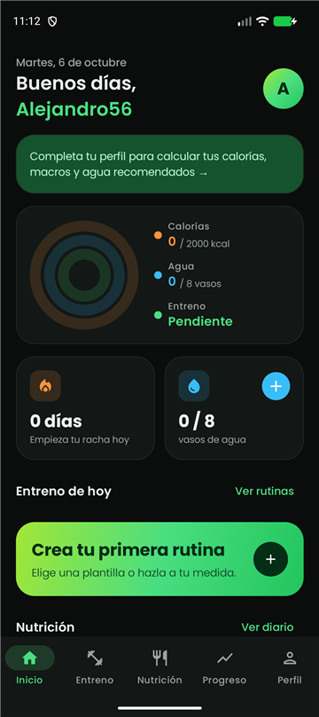
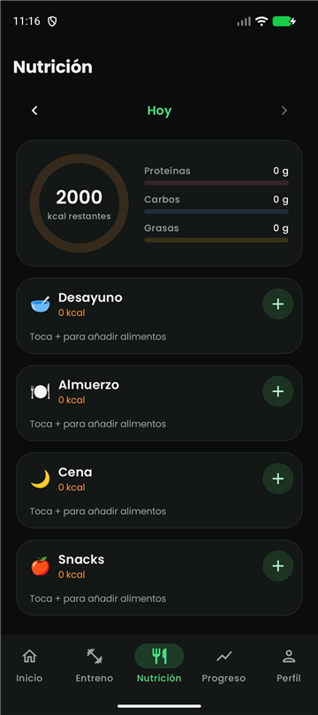
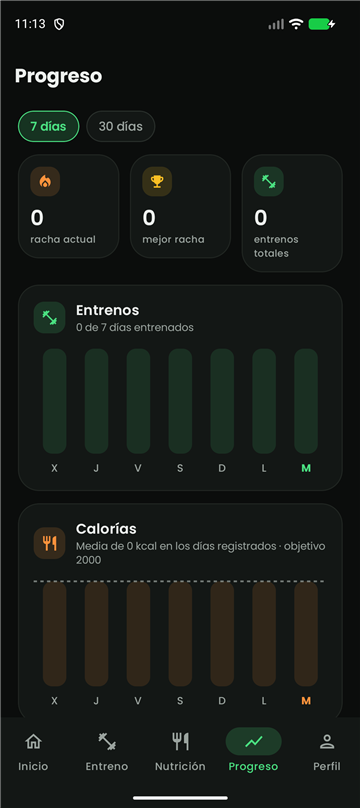
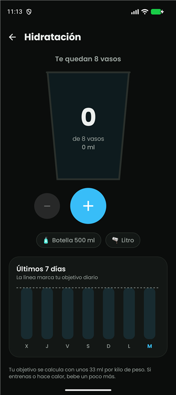

# FitTrack

App Android para llevar en un solo sitio el entreno, la alimentación y la hidratación. Hecha con **Kotlin**, **Jetpack Compose** y **Firebase**, con arquitectura **MVVM**.

<p>
  
  
  
  
</p>

## Qué hace

- **Inicio**: tres anillos con el progreso del día (calorías, agua y entreno), racha de días seguidos entrenando y acceso directo al siguiente entreno.
- **Entreno**: rutinas propias o a partir de 9 plantillas, filtro por categoría y vista de la semana.
- **Modo entreno**: cronómetro, series que se marcan tocándolas y temporizador de descanso (60, 90 o 120 s) que vibra al terminar. Al acabar, se guarda en el historial.
- **Nutrición**: diario por días con calorías y macros frente al objetivo. Buscador de alimentos local y en la API de [Open Food Facts](https://world.openfoodfacts.org), con selector de gramos. Se borra deslizando, con opción de deshacer.
- **Hidratación**: vaso animado, objetivo calculado según el peso y gráfico de la semana.
- **Progreso**: gráficos de 7 y 30 días de entrenos, calorías y agua, con racha actual y mejor racha.
- **Perfil**: calcula al momento el IMC, las calorías diarias (fórmula de Mifflin-St Jeor), los macros y el agua recomendada.
- **Cuenta**: registro con email o con Google. Modo claro y oscuro.

## Arquitectura

```
UI (Compose)  →  ViewModel (StateFlow)  →  Repositorio  →  Firebase
   pantallas        estado de pantalla       acceso a datos    Auth · Firestore · Storage
```

- **`presentation/`**: una carpeta por pantalla con su `Screen` y su `ViewModel`. Las pantallas solo pintan el estado y avisan de lo que hace el usuario.
- **`data/`**: modelos de la app y repositorios. Es la única parte que habla con Firebase; los listeners de Firestore se exponen como `Flow`.
- **`domain/`**: cálculos de nutrición y rachas como funciones puras, sin Android, para poder probarlos con tests.
- **`ui/`**: tema (colores de marca, modo claro y oscuro) y componentes reutilizables: anillos de progreso, gráfico de barras dibujado con `Canvas`, tarjetas...
- **`FitTrackApp`**: crea los repositorios una vez y los entrega a los ViewModels mediante factorías (inyección de dependencias manual).

### Datos en Firestore

```
users/{uid}                               perfil y objetivos
users/{uid}/agua/{yyyy-MM-dd}             vasos del día
users/{uid}/dieta/{yyyy-MM-dd}/comidas    alimentos del día
users/{uid}/rutinas/{id}                  ejercicios e historial de días completados
```

## Tecnologías

| | |
|---|---|
| Lenguaje | Kotlin, corrutinas y Flow |
| UI | Jetpack Compose, Material 3, Navigation Compose |
| Arquitectura | MVVM con `ViewModel` y `StateFlow` |
| Backend | Firebase Authentication (email y Google), Cloud Firestore, Storage |
| Imágenes | Coil |
| Tests | JUnit |

## Tests

```bash
./gradlew testDebugUnitTest
```

Prueban los cálculos de IMC, calorías, macros, agua y rachas (`app/src/test`).

## Cómo ejecutarla

1. Abre el proyecto con Android Studio.
2. La app usa el proyecto de Firebase de `app/google-services.json`. Para usar uno propio, sustitúyelo y activa en Firebase el inicio de sesión con email y con Google.
3. Ejecuta en un móvil o emulador con Android 8.0 (API 26) o superior.

---

Alejandro Corral Carrasco · [alejandrocorral.es](https://alejandrocorral.es) · [LinkedIn](https://www.linkedin.com/in/alejandro-corral-carrasco/)
